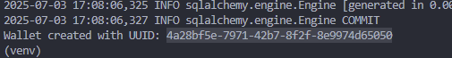

# Wallet API

Простое REST API для работы с кошельками. Позволяет создавать кошельки, пополнять их, снимать средства и получать текущий баланс. Реализована защита от гонки данных при операциях с балансом.

## 📂 Структура проекта

```
wallet_api/
├── app/
│   ├── core/            # Настройки проекта и конфигурация
│   ├── models/          # SQLAlchemy модели
│   ├── routers/         # FastAPI роутеры (эндпоинты)
│   ├── schemas/         # Pydantic схемы
│   ├── services/        # Бизнес-логика
│   ├── constants.py     # Константы проекта
│   └── main.py          # Точка входа FastAPI
├── migrations/          # Alembic миграции
├── tests/               # Тесты
├── .env                 # Переменные окружения
├── alembic.ini          # Конфигурация Alembic
├── create_wallet.py     # Скрипт для создания тестового кошелька
├── docker-compose.yml   # Docker Compose
├── Dockerfile           # Dockerfile приложения
├── requirements.txt     # Зависимости проекта
└── README.md            # Документация
```

---

## 🚀 Запуск проекта

### 1. Клонируй репозиторий

```bash
git clone https://github.com/slava225678/wallet_api.git
cd wallet_api
```

### 2. Установи и активируй виртуальное окружение

Windows:

```bash
python -m venv venv
sourse venv/Scripts/activate
```

Linux/macOS:

```bash
python3 -m venv venv
source venv/bin/activate
```

### 3. Установи зависимости

```bash
pip install -r requirements.txt
```

### 4. Поднятие контейнеров

```bash
docker-compose up --build
```

Приложение будет доступно по адресу: [http://localhost:8000](http://localhost:8000)

Документация Swagger: [http://localhost:8000/docs](http://localhost:8000/docs)

---

## 🧪 Запуск тестов

Внутри контейнера:

```bash
pytest
```

Если запуск не срабатывает, то нужно указать `PYTHONPATH`, например:

```bash
PYTHONPATH=C:/your_path/wallet_api pytest
```

---

## 📌 Скрипт для создания тестового кошелька

Если необходимо создать тестовый кошелёк в базе данных вручную (например, для отладки или демонстрации), можно использовать скрипт `create_wallet.py`:

### Пример запуска скрипта `create_wallet.py`

```bash
python create_wallet.py
```

После запуска вы получите UUID нового кошелька — его можно использовать в API-запросах.



---

## ✅ Поддерживаемые операции

### Получить баланс:

`GET /wallet/{wallet_uuid}`

### Провести операцию (пополнение/списание):

`POST /wallet/{wallet_uuid}/operation`

```json
{
  "operation_type": "DEPOSIT" | "WITHDRAW",
  "amount": 100.0
}
```

---

## 🔧 Используемые технологии

* **FastAPI** — веб-фреймворк
* **PostgreSQL** — СУБД
* **SQLAlchemy 2.0** + async
* **Alembic** — миграции
* **Docker** + **Docker Compose**
* **Pytest** — тестирование

---

